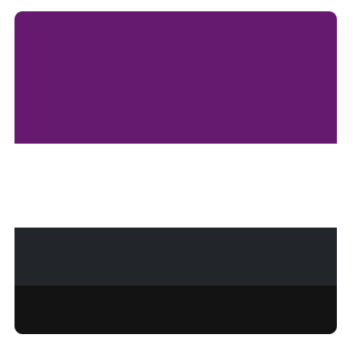

# Soyuz Spacecraft

Para la asignatura de DIW debemos recrear una web hecha a partir de una de las plantillas de [Free Website Templates](https://freewebsitetemplates.com/) utilizando Bootstrap. En mi caso, me ha tocado la plantilla de Space Science y la he rediseñado con algunos cambios estéticos, ya que algunos de sus detalles no me gustaban demasiado tal y como estaban originalmente.

## Despliegue en Netlify

[Netlify](https://romantic-panini-fad45b.netlify.app/)

## Elementos de Bootstrap utilizados

- Utilities
  - Spacing (margin y padding)
  - Background
  - Colors
  - Flex
  - Text

- Components
  - Buttons
  - Cards
  - Collapse
  - Navbar
  - Modals
  - Carousel

## Cosas personalizadas

- Un fondo de pantalla para el index.
- Añadido un tamaño de letra mayor que el h1 por defecto.
- Añadida una fuente distinta a la de Bootstrap (Gill Sans).

## Paleta de colores

- Primario: #64186E
- Texto sobre fondo oscuro: #FFFFFF
- Bootstrap dark: #212529
- Secundario: #121212